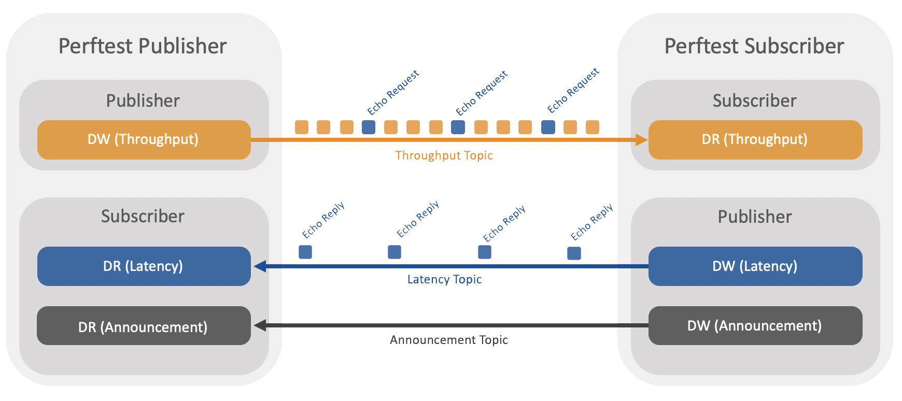

<br />
<p align="center">
  <a href="https://github.com/rticommunity/rtiperftest">
    
  </a>

  <h1 align="center"><strong>RTI Perftest</strong></h1>

  <p align="center">
    <em>RTI's Network Performance Benchmarking Tool</em>
    <br />
    <a href="https://community.rti.com/static/documentation/perftest/current/index.html"><strong>Explore the documentation »</strong></a>
    <br />
    <a href="https://github.com/rticommunity/rtiperftest/releases#binaries">Binaries</a>
    ·
    <a href="https://community.rti.com/static/documentation/perftest/current/download.html#download-instructions">Download</a>
    ·
    <a href="https://community.rti.com/static/documentation/perftest/current/compilation.html">Compile</a>
    ·
    <a href="https://community.rti.com/static/documentation/perftest/current/execution.html">Execution</a>
    ·
    <a href="https://community.rti.com/static/documentation/perftest/current/examples.html">Examples</a>
  </p>
</p>

<br>

## <strong>Overview</strong>

**RTI Perftest** is a command line tool intended to measure the minimum latency,
maximum throughput and loaded latency in a very configurable set of scenarios.
It can help you answer questions such as:

* For a given publishing configuration (e.g., queue size, batching settings), sample size, and subscribing configuration (e.g., queue size, Listener vs. WaitSet), what is the throughput of my network?
* When my network is heavily loaded, what latency can I expect?
* For a given configuration, what is the best-case latency with no other traffic on the network?

### _How does it work_

The publishing side of the test writes data as fast as it can. Every few samples (configured through the command line), it sends a special sample requesting an echo from the subscribing side. It uses this ping -> pong exchange to measure the round-trip time latency (RTT) and then the one-way latency.

The publisher prints the latency test results while the subscriber prints the throughput results.



**RTI Perftest** allows 2 operational modes: _Throughput Test_ and _Latency Test_

Learn more [here »](https://community.rti.com/static/documentation/perftest/current/introduction.html)

## <strong>Features</strong>

**RTI Perftest** features include:
* Supports **RTI Connext DDS Professional** and **RTI Connext DDS Micro**.
* Suppots multiple platform including Windows, Linux, Mac, VxWorks or Android.
* Supports multiple test setups - Multicast, One-to-many communication (Pub -> Sub), Latency test, Throughput test, Latency vs Throughput test.
* Supports using raw transports (UDPv4 Sockets and Shared Memory segments).
* Suports benchmarking Connext Pro and Micro features such as Flat Data and Zero Copy.

## <strong>Getting Started</strong>

This is an example of how you may give instructions on setting up your project locally.
To get a local copy up and running follow these simple example steps.

### _Download_

**RTI Perftest** bundle is provided in 3 different ways:

1. Clone and compile from the official Github repository:
```sh
git clone https://github.com/rticommunity/rtiperftest.git
```

2. Download and compile from: github.com/rticommunity/rtiperftest.

3. Download the executables for popular platforms from: https://github.com/rticommunity/rtiperftest/releases in the “Binaries” section of the **RTI Perftest** release page.

To learn more about the supported platforms and installation, please refer to the
[Documentation](https://community.rti.com/static/documentation/perftest/current/download.html).


### _Requisites_

If you need to compile **RTI Perftest** these are the 2 main requisites. This is not
needed if you downloaded the executables already compiled, you can skip this section.

* **RTI Connext DDS Professional** or **RTI Connext DDS Micro** should be installed
  in the system where the build.sh script is going to run. The Target libraries for
  the platform to be generated should also be installed.
* The `$NDDSHOME` environment variable should be set correctly. Alternatively,
  `$NDDSHOME` can be passed directly to the `build.sh` script by using the `--nddshome <PATH>` command-line option.
* If you intend to compile and test using *RTI Security Plugins*, you will need to
  link against the OpenSSL libraries for your architecture.

Learn more [here »](https://community.rti.com/static/documentation/perftest/current/introduction.html)

### _Compile_
For Linux, MacOS, QNX, VxWorks, Lynx, and Android, **RTI Perftest** makes use of a script in the top level directory named ```build.sh```. In order to build using ```build.sh``` you just need to invoke the script with the command-line parameters desired. 

For example, for a given architecture (x64Darwin15clang7.0) for C++ (traditional and modern) and Java the command would be

```sh
./build.sh --platform x64Darwin15clang7.0
```

Learn more about compilation for other platforms and examples [here »](https://community.rti.com/static/documentation/perftest/current/compilation.html)


## <strong>Usage</strong>
The following are examples of how to run the performance test for two use cases:

* The tests below print final results only; if you want to see intermediate values, remove the ```-noprint``` argument from the command line.
* If you are running on two unequal machines---i.e., one machine is faster (has better processors) than another---you will see better performance by running the Publisher on the slower machine.

### Example 1: 1-to-1, Unicast, Best Latency as a Function of Message Size

Publisher:

```sh
  bin/<arch>/release/perftest_cpp -pub -noPrint -nic <ipaddr> -dataLen <length> -latencyTest -executionTime 100
```

Subscriber:

```sh
  bin/<arch>/release/perftest_cpp -sub -noPrint -nic <ipaddr> -domain <ID> -multicast
```

Modify ```-dataLen <bytes> ```to see latencies for different data sizes. Set ```-executionTime <seconds>```
to be >=100 for statistically better results.

### Example 2: 1-to-1, Multicast, Maximum Throughput as a Function of Message Size (with Batching)
Publisher:
```sh
bin/<arch>/release/perftest_cpp -pub -noPrint -nic <ipaddr> -dataLen <length> -batchSize <bytes> -multicast -executionTime 100
```
Subscriber:
```sh
bin/<arch>/release/perftest_cpp -sub -noprint -nic <ipaddr> -multicast
```

To achieve maximum throughput, start by setting See ```-batchSize <bytes>``` to 8192, then increase the size to see if you get better throughput.

_Note: Batching will not be enabled if the data length is larger than 1/2 the batch size._

### More examples

See more examples [here »](https://community.rti.com/static/documentation/perftest/current/examples.html)

## <strong>Configuring RTI Perftest</strong>

See how to configure **RTI Perftest** [here »](https://community.rti.com/static/documentation/perftest/current/command_line_parameters.html)

## <strong>License</strong>

Distributed under the EPL License. See the [license](LICENSE.md) file for more information.