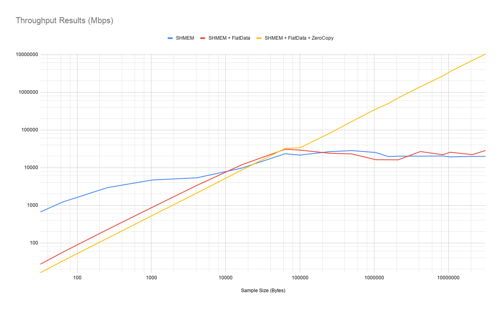
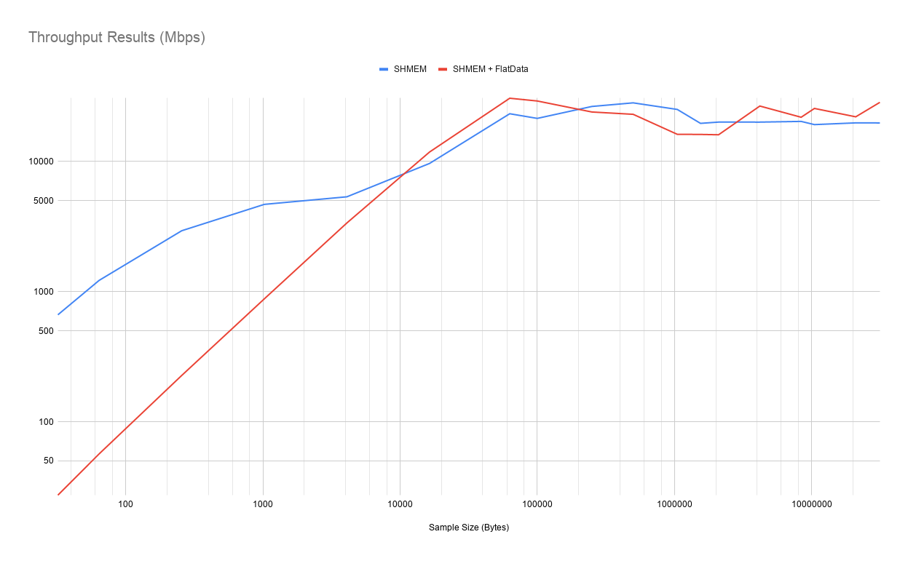
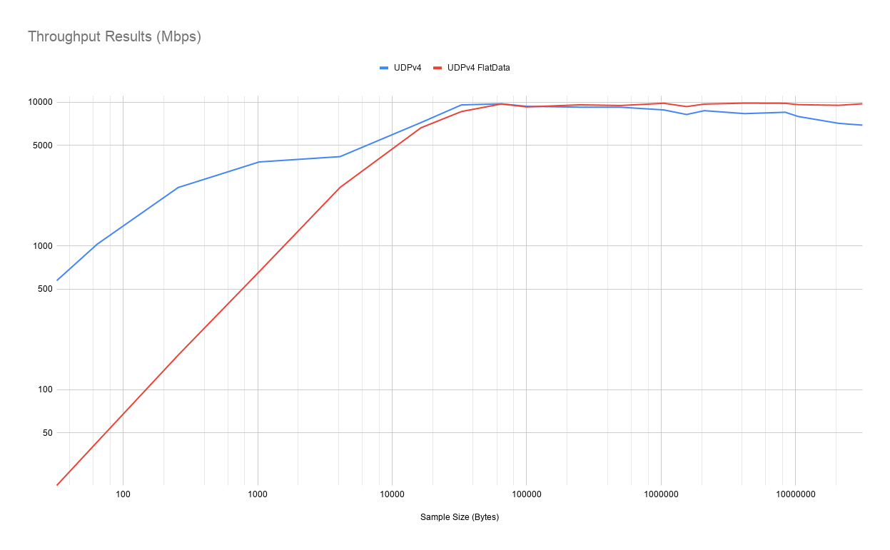
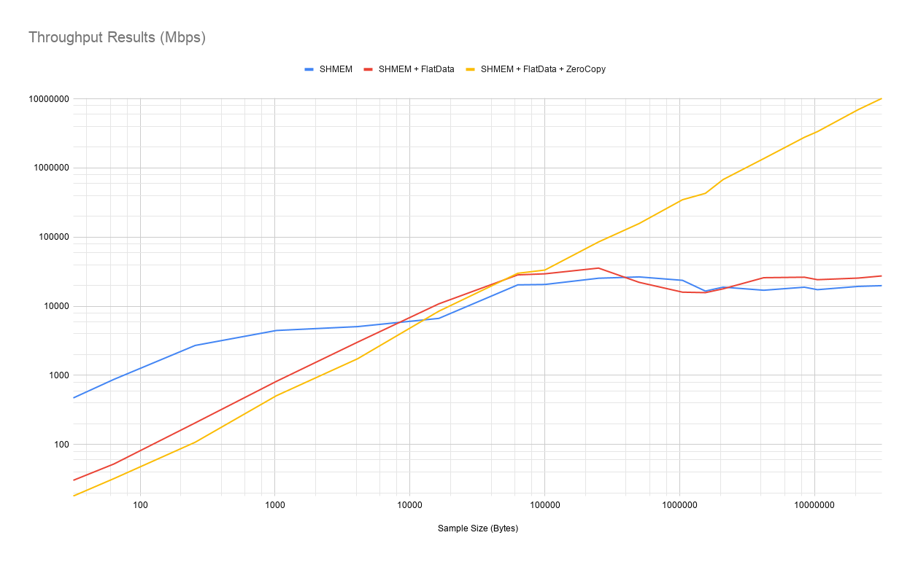
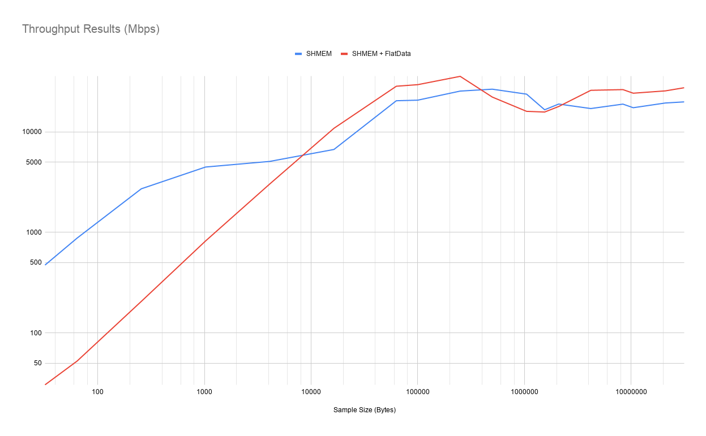
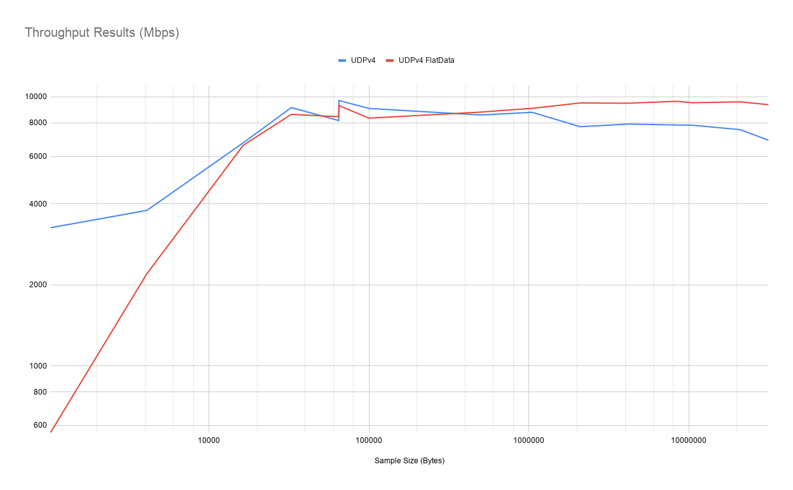

# RTI Perftest default type

## Compile *RTI Perftest* (no-custom-types)

```
setenv arch x64Linux3gcc4.8.2
./build.sh --platform $arch --nddshome /home/perfuser/ndds/ndds.6.0.0_ER-137 --flatData-max-size 31457280 --cpp-build
```

## SHMEM Throughput

### Regular

- **Publisher**

        byte_sizes=(32 64 256 1024 4096 16384 63000 100000 250000 500000 1048576 1548576 2097152 4194304 8388608 10485760 20971520 31457280)
        for DLEN in "${byte_sizes[@]}";
        do
        bin/x64Linux3gcc4.8.2/release/perftest_cpp -pub -domain 1 -exec 30 -dataLen $DLEN -noPrint -transport SHMEM;
        sleep 3;
        done

- **Subscriber**

        byte_sizes=(32 64 256 1024 4096 16384 63000 100000 250000 500000 1048576 1548576 2097152 4194304 8388608 10485760 20971520 31457280)
        for DLEN in "${byte_sizes[@]}";
        do
        bin/x64Linux3gcc4.8.2/release/perftest_cpp -sub -domain 1 -dataLen $DLEN -noPrint -transport SHMEM 2>/dev/null;
        sleep 3;
        done

#### Results


    Length:    32  Packets: 77849677  Packets/s(ave): 2594706  Mbps(ave):   664.2  Lost:     0 (0.00%)
    Length:    64  Packets: 71581304  Packets/s(ave): 2386046  Mbps(ave):  1221.7  Lost:     0 (0.00%)
    Length:   256  Packets: 43076525  Packets/s(ave): 1435882  Mbps(ave):  2940.7  Lost:     0 (0.00%)
    Length:  1024  Packets: 17168648  Packets/s(ave):  572288  Mbps(ave):  4688.2  Lost:     0 (0.00%)
    Length:  4096  Packets:  4908091  Packets/s(ave):  163602  Mbps(ave):  5360.9  Lost:     0 (0.00%)
    Length: 16384  Packets:  2212969  Packets/s(ave):   73765  Mbps(ave):  9668.6  Lost:     0 (0.00%)
    Length: 63000  Packets:  1387456  Packets/s(ave):   46248  Mbps(ave): 23309.3  Lost:     0 (0.00%)
    Length: 100000  Packets:   804949  Packets/s(ave):   26831  Mbps(ave): 21465.5  Lost:     0 (0.00%)
    Length: 250000  Packets:   397658  Packets/s(ave):   13255  Mbps(ave): 26510.8  Lost:     0 (0.00%)
    Length: 500000  Packets:   211962  Packets/s(ave):    7065  Mbps(ave): 28262.2  Lost:     0 (0.00%)
    Length: 1048576  Packets:    89951  Packets/s(ave):    2998  Mbps(ave): 25153.5  Lost:     0 (0.00%)
    Length: 1548576  Packets:    47602  Packets/s(ave):    1586  Mbps(ave): 19659.3  Lost:     0 (0.00%)
    Length: 2097152  Packets:    35947  Packets/s(ave):    1198  Mbps(ave): 20105.6  Lost:     0 (0.00%)
    Length: 4194304  Packets:    17967  Packets/s(ave):     599  Mbps(ave): 20100.6  Lost:     0 (0.00%)
    Length: 8388608  Packets:     9093  Packets/s(ave):     303  Mbps(ave): 20350.3  Lost:     0 (0.00%)
    Length: 10485760  Packets:     6873  Packets/s(ave):     229  Mbps(ave): 19230.3  Lost:     0 (0.00%)
    Length: 20971520  Packets:     3542  Packets/s(ave):     118  Mbps(ave): 19830.5  Lost:     0 (0.00%)
    Length: 31457280  Packets:     2357  Packets/s(ave):      78  Mbps(ave): 19809.1  Lost:     0 (0.00%)


### Flat Data

- **Publisher**

        byte_sizes=(32 64 256 1024 4096 16384 63000 100000 250000 500000 1048576 1548576 2097152 4194304 8388608 10485760 20971520 31457280)
        for DLEN in "${byte_sizes[@]}";
        do
        bin/x64Linux3gcc4.8.2/release/perftest_cpp -pub -domain 1 -exec 30 -dataLen $DLEN -noPrint -transport SHMEM -flat;
        sleep 3;
        done

- **Subscriber**

        byte_sizes=(32 64 256 1024 4096 16384 63000 100000 250000 500000 1048576 1548576 2097152 4194304 8388608 10485760 20971520 31457280)
        for DLEN in "${byte_sizes[@]}";
        do
        bin/x64Linux3gcc4.8.2/release/perftest_cpp -sub -domain 1 -dataLen $DLEN -noPrint -transport SHMEM -flat 2>/dev/null;
        sleep 3;
        done

#### Results

    Length:    32  Packets:  3202449  Packets/s(ave):  106748  Mbps(ave):    27.3  Lost:     0 (0.00%)
    Length:    64  Packets:  3322883  Packets/s(ave):  110762  Mbps(ave):    56.7  Lost:     0 (0.00%)
    Length:   256  Packets:  3327510  Packets/s(ave):  110916  Mbps(ave):   227.2  Lost:     0 (0.00%)
    Length:  1024  Packets:  3226650  Packets/s(ave):  107554  Mbps(ave):   881.1  Lost:     0 (0.00%)
    Length:  4096  Packets:  3090483  Packets/s(ave):  103016  Mbps(ave):  3375.6  Lost:     0 (0.00%)
    Length: 16384  Packets:  2708081  Packets/s(ave):   90269  Mbps(ave): 11831.8  Lost:     0 (0.00%)
    Length: 63000  Packets:  1825285  Packets/s(ave):   60842  Mbps(ave): 30664.9  Lost:     0 (0.00%)
    Length: 100000  Packets:  1095321  Packets/s(ave):   36510  Mbps(ave): 29208.6  Lost:     0 (0.00%)
    Length: 250000  Packets:   360631  Packets/s(ave):   12020  Mbps(ave): 24041.7  Lost:     0 (0.00%)
    Length: 500000  Packets:   173060  Packets/s(ave):    5768  Mbps(ave): 23074.0  Lost:     0 (0.00%)
    Length: 1048576  Packets:    57972  Packets/s(ave):    1931  Mbps(ave): 16201.6  Lost:     0 (0.00%)
    Length: 1548576  Packets:    39168  Packets/s(ave):    1304  Mbps(ave): 16162.0  Lost:     0 (0.00%)
    Length: 2097152  Packets:    28734  Packets/s(ave):     957  Mbps(ave): 16065.6  Lost:     0 (0.00%)
    Length: 4194304  Packets:    23926  Packets/s(ave):     796  Mbps(ave): 26711.3  Lost:     0 (0.00%)
    Length: 8388608  Packets:     9831  Packets/s(ave):     326  Mbps(ave): 21904.5  Lost:     0 (0.00%)
    Length: 10485760  Packets:     9155  Packets/s(ave):     305  Mbps(ave): 25598.2  Lost:     0 (0.00%)
    Length: 20971520  Packets:     3957  Packets/s(ave):     131  Mbps(ave): 22074.5  Lost:     0 (0.00%)
    Length: 31457280  Packets:     3436  Packets/s(ave):     113  Mbps(ave): 28518.1  Lost:     0 (0.00%)

#### Notes

- For FlatData we cannot make use of the `batching` feature, this is why for sample sizes < 4096 SHMEM provides better results.

### Zero-Copy

- **Publisher**

        byte_sizes=(32 64 256 1024 4096 16384 63000 100000 250000 500000 1048576 1548576 2097152 4194304 8388608 10485760 20971520 31457280)
        for DLEN in "${byte_sizes[@]}";
        do
        bin/x64Linux3gcc4.8.2/release/perftest_cpp -pub -domain 1 -exec 30 -dataLen $DLEN -noPrint -transport SHMEM -zero;
        sleep 3;
        done

- **Subscriber**

        byte_sizes=(32 64 256 1024 4096 16384 63000 100000 250000 500000 1048576 1548576 2097152 4194304 8388608 10485760 20971520 31457280)
        for DLEN in "${byte_sizes[@]}";
        do
        bin/x64Linux3gcc4.8.2/release/perftest_cpp -sub -domain 1 -dataLen $DLEN -noPrint -transport SHMEM -zero 2>/dev/null;
        sleep 3;
        done

#### Results

    Length:    32  Packets:  1902520  Packets/s(ave):   63417  Mbps(ave):    16.2  Lost:     0 (0.00%)
    Length:    64  Packets:  1950802  Packets/s(ave):   65026  Mbps(ave):    33.3  Lost:     0 (0.00%)
    Length:   256  Packets:  1951267  Packets/s(ave):   65042  Mbps(ave):   133.2  Lost:     0 (0.00%)
    Length:  1024  Packets:  1959459  Packets/s(ave):   65315  Mbps(ave):   535.1  Lost:     0 (0.00%)
    Length:  4096  Packets:  1935679  Packets/s(ave):   64522  Mbps(ave):  2114.3  Lost:     0 (0.00%)
    Length: 16384  Packets:  1965052  Packets/s(ave):   65501  Mbps(ave):  8585.4  Lost:     0 (0.00%)
    Length: 63000  Packets:  1915235  Packets/s(ave):   63841  Mbps(ave): 32175.9  Lost:     0 (0.00%)
    Length: 100000  Packets:  1258910  Packets/s(ave):   41963  Mbps(ave): 33570.9  Lost:     0 (0.00%)
    Length: 250000  Packets:  1221681  Packets/s(ave):   40722  Mbps(ave): 81445.2  Lost:     0 (0.00%)
    Length: 500000  Packets:  1258794  Packets/s(ave):   41959  Mbps(ave): 167838.9  Lost:     0 (0.00%)
    Length: 1048576  Packets:  1274339  Packets/s(ave):   42477  Mbps(ave): 356330.6  Lost:     0 (0.00%)
    Length: 1548576  Packets:  1218081  Packets/s(ave):   40602  Mbps(ave): 503010.6  Lost:     0 (0.00%)
    Length: 2097152  Packets:  1262692  Packets/s(ave):   42089  Mbps(ave): 706147.7  Lost:     0 (0.00%)
    Length: 4194304  Packets:  1255663  Packets/s(ave):   41855  Mbps(ave): 1404435.9  Lost:     0 (0.00%)
    Length: 8388608  Packets:  1216593  Packets/s(ave):   40553  Mbps(ave): 2721469.2  Lost:     0 (0.00%)
    Length: 10485760  Packets:  1261444  Packets/s(ave):   42048  Mbps(ave): 3527250.4  Lost:     0 (0.00%)
    Length: 20971520  Packets:  1252665  Packets/s(ave):   41755  Mbps(ave): 7005399.2  Lost:     0 (0.00%)
    Length: 31457280  Packets:  1226263  Packets/s(ave):   40875  Mbps(ave): 10286617.0  Lost:     0 (0.00%)

### Plots




=========================================================================================================

## UDPv4 THROUGHPUT

### Regular

- **Publisher**

        byte_sizes=(32 64 256 1024 4096 16384 64969 64970 100000 250000 500000 1048576 1548576 2097152 4194304 8388608 10485760 20971520 31457280)
        for DLEN in "${byte_sizes[@]}";
        do
        bin/x64Linux3gcc4.8.2/release/perftest_cpp -pub -domain 1 -exec 30 -dataLen $DLEN -noPrint -transport UDPv4 -nic enp5s0;
        sleep 3;
        done

- **Subscriber**

        byte_sizes=(32 64 256 1024 4096 16384 64969 64970 100000 250000 500000 1048576 1548576 2097152 4194304 8388608 10485760 20971520 31457280)
        for DLEN in "${byte_sizes[@]}";
        do
        bin/x64Linux3gcc4.8.2/release/perftest_cpp -sub -domain 1 -dataLen $DLEN -noPrint -transport UDPv4 -nic enp5s0 2>/dev/null;
        sleep 3;
        done

#### Results

    Length:    32  Packets: 67169420  Packets/s(ave): 2238734  Mbps(ave):   573.1  Lost:     0 (0.00%)
    Length:    64  Packets: 60243522  Packets/s(ave): 2007982  Mbps(ave):  1028.1  Lost:     0 (0.00%)
    Length:   256  Packets: 37335521  Packets/s(ave): 1244517  Mbps(ave):  2548.8  Lost:     0 (0.00%)
    Length:  1024  Packets: 14064941  Packets/s(ave):  468830  Mbps(ave):  3840.7  Lost:     0 (0.00%)
    Length:  4096  Packets:  3829756  Packets/s(ave):  127658  Mbps(ave):  4183.1  Lost:     0 (0.00%)
    Length: 16384  Packets:  1652773  Packets/s(ave):   55091  Mbps(ave):  7221.0  Lost:     0 (0.00%)
    Length: 64969  Packets:   557290  Packets/s(ave):   18575  Mbps(ave):  9654.9  Lost:     0 (0.00%)
    Length: 64970  Packets:   562911  Packets/s(ave):   18763  Mbps(ave):  9752.4  Lost:     0 (0.00%)
    Length: 100000  Packets:   351297  Packets/s(ave):   11709  Mbps(ave):  9367.9  Lost:     0 (0.00%)
    Length: 250000  Packets:   138655  Packets/s(ave):    4621  Mbps(ave):  9244.0  Lost:     0 (0.00%)
    Length: 500000  Packets:    69270  Packets/s(ave):    2308  Mbps(ave):  9235.7  Lost:     0 (0.00%)
    Length: 1048576  Packets:    31621  Packets/s(ave):    1054  Mbps(ave):  8842.9  Lost:     0 (0.00%)
    Length: 1548576  Packets:    19890  Packets/s(ave):     663  Mbps(ave):  8218.7  Lost:     0 (0.00%)
    Length: 2097152  Packets:    15616  Packets/s(ave):     520  Mbps(ave):  8738.2  Lost:     0 (0.00%)
    Length: 4194304  Packets:     7443  Packets/s(ave):     248  Mbps(ave):  8334.2  Lost:     0 (0.00%)
    Length: 8388608  Packets:     3808  Packets/s(ave):     126  Mbps(ave):  8520.2  Lost:     0 (0.00%)
    Length: 10485760  Packets:     2852  Packets/s(ave):      94  Mbps(ave):  7957.3  Lost:     0 (0.00%)
    Length: 20971520  Packets:     1271  Packets/s(ave):      42  Mbps(ave):  7131.0  Lost:     0 (0.00%)
    Length: 31457280  Packets:      855  Packets/s(ave):      27  Mbps(ave):  6928.4  Lost:     0 (0.00%)


### FlatData

- **Publisher**

        byte_sizes=(32 64 256 1024 4096 16384 32768 64970 100000 250000 500000 1048576 1548576 2097152 4194304 8388608 10485760 20971520 31457280)
        for DLEN in "${byte_sizes[@]}";
        do
            bin/x64Linux3gcc4.8.2/release/perftest_cpp -pub -domain 1 -exec 30 -dataLen $DLEN -noPrint -transport UDPv4 -nic enp5s0 -flat;
            sleep 3;
        done

- **Subscriber**

        byte_sizes=(32 64 256 1024 4096 16384 32768 64970 100000 250000 500000 1048576 1548576 2097152 4194304 8388608 10485760 20971520 31457280)
        for DLEN in "${byte_sizes[@]}";
        do
            bin/x64Linux3gcc4.8.2/release/perftest_cpp -sub -domain 1 -dataLen $DLEN -noPrint -transport UDPv4 -nic enp5s0 -flat 2>/dev/null;
            sleep 3;
        done

#### Results

    Length:    32  Packets:  2520789  Packets/s(ave):   84026  Mbps(ave):    21.5  Lost:     0 (0.00%)
    Length:    64  Packets:  2533805  Packets/s(ave):   84460  Mbps(ave):    43.2  Lost:     0 (0.00%)
    Length:   256  Packets:  2543088  Packets/s(ave):   84769  Mbps(ave):   173.6  Lost:     0 (0.00%)
    Length:  1024  Packets:  2417745  Packets/s(ave):   80591  Mbps(ave):   660.2  Lost:     0 (0.00%)
    Length:  4096  Packets:  2337340  Packets/s(ave):   77911  Mbps(ave):  2553.0  Lost:     0 (0.00%)
    Length: 16384  Packets:  1520957  Packets/s(ave):   50697  Mbps(ave):  6645.1  Lost:     0 (0.00%)
    Length: 32768  Packets:   986346  Packets/s(ave):   32878  Mbps(ave):  8618.8  Lost: 484451 (32.94%)
    Length: 64969  Packets:   558029  Packets/s(ave):   18600  Mbps(ave):  9667.7  Lost:  4001 (0.71%)
    Length: 64970  Packets:   561714  Packets/s(ave):   18723  Mbps(ave):  9731.6  Lost:  2104 (0.37%)
    Length: 100000  Packets:   347990  Packets/s(ave):   11599  Mbps(ave):  9279.5  Lost: 141226 (28.87%)
    Length: 250000  Packets:   143932  Packets/s(ave):    4797  Mbps(ave):  9595.1  Lost: 62127 (30.15%)
    Length: 500000  Packets:    71181  Packets/s(ave):    2372  Mbps(ave):  9490.4  Lost:  7254 (9.25%)
    Length: 1048576  Packets:    35181  Packets/s(ave):    1172  Mbps(ave):  9837.1  Lost:  2951 (7.74%)
    Length: 1548576  Packets:    22593  Packets/s(ave):     753  Mbps(ave):  9329.3  Lost:  4763 (17.41%)
    Length: 2097152  Packets:    17370  Packets/s(ave):     578  Mbps(ave):  9711.6  Lost:  3876 (18.24%)
    Length: 4194304  Packets:     8820  Packets/s(ave):     293  Mbps(ave):  9857.7  Lost:   789 (8.21%)
    Length: 8388608  Packets:     4404  Packets/s(ave):     146  Mbps(ave):  9830.8  Lost:  1076 (19.64%)
    Length: 10485760  Packets:     3448  Packets/s(ave):     114  Mbps(ave):  9620.5  Lost:  3442 (49.96%)
    Length: 20971520  Packets:     1704  Packets/s(ave):      56  Mbps(ave):  9524.7  Lost:  5081 (74.89%)
    Length: 31457280  Packets:     1180  Packets/s(ave):      38  Mbps(ave):  9757.6  Lost: 124827 (99.06%)

### Plots



=========================================================================================================

# Custom Type

## Changes in code

- Create a folder in `srcIdl` named `customType` and then create a `test.idl`, this is the content:

        const long MAX_SIZE = 31457280;

        @final
        struct Test {
            sequence<octet, MAX_SIZE> test_seq;
            long test_long;
        };

        @mutable
        @language_binding(FLAT_DATA)
        struct Test_flat {
            sequence<octet, MAX_SIZE> test_seq;

            long test_long;
        };

- Copy in srcCpp the changes suggested in the following example in resources: `resource/examples_customType/flatdata/srcCpp/CustomType.cxx`.

## Build Command

    setenv arch x64Linux3gcc4.8.2
    ./build.sh --platform $arch --nddshome /home/perfuser/ndds/ndds.6.0.0_ER-137 --customType Test --customTypeFlatData Test_flat --flatData-max-size 31457280 --cpp-build


### Note 1

If you find this compilation issue (due to your compiler not supporting auto by default)

    CustomType.cxx: In function 'bool set_custom_type_data_flatdata(rti::flat::flat_type_traits<Test_flat>::builder&, long unsigned int, int)':
    CustomType.cxx:142:5: warning: 'auto' changes meaning in C++11; please remove it [-Wc++0x-compat]
        auto test_seqBuilder = data.build_test_seq();
        ^
    CustomType.cxx:142:10: error: 'test_seqBuilder' does not name a type
        auto test_seqBuilder = data.build_test_seq();
            ^
    CustomType.cxx:143:5: error: 'test_seqBuilder' was not declared in this scope
        test_seqBuilder.add_n(targetDataLen);


You can modify `auto` to be `rti::flat::PrimitiveSequenceBuilder<DDS_Octet>` in `srcCpp/CustomType.cxx`

### Note 2

Upon execution, you will see these 2 messages, RTI Perftest will choose for you when to switch to Large Data and When to switch to Unbounded secuences automatically.

```
[IMPORTANT]: Enabling Asynchronous publishing: -datalen (8388608) is
             larger than the minimum message_size_max across
             all enabled transports (64969)

[IMPORTANT]: Using the Unbounded Sequence Type: -datalen (8388608) is
             larger than MAX_BOUNDED_SEQ_SIZE (1048576)

```

Initially, you should need to specify `-unbounded` or `-asynchronous` (you can use them if you want to modify the behavior of the test on these 2 aspects).

### Note 3

You can check that you are using the right type because you will see at the beginning of the test:

`Custom Type provided: 'Test'`

## SHMEM Throughput

### Regular

- **Publisher**

        byte_sizes=(32 64 256 1024 4096 16384 63000 100000 250000 500000 1048576 1548576 2097152 4194304 8388608 10485760 20971520 31457280)
        for DLEN in "${byte_sizes[@]}";
        do
        bin/x64Linux3gcc4.8.2/release/perftest_cpp -pub -domain 1 -exec 30 -dataLen $DLEN -noPrint -transport SHMEM;
        sleep 3;
        done

- **Subscriber**

        byte_sizes=(32 64 256 1024 4096 16384 63000 100000 250000 500000 1048576 1548576 2097152 4194304 8388608 10485760 20971520 31457280)
        for DLEN in "${byte_sizes[@]}";
        do
        bin/x64Linux3gcc4.8.2/release/perftest_cpp -sub -domain 1 -dataLen $DLEN -noPrint -transport SHMEM 2>/dev/null;
        sleep 3;
        done

#### Results

    Length:    32  Packets: 55417768  Packets/s(ave): 1847062  Mbps(ave):   472.8  Lost:     0 (0.00%)
    Length:    64  Packets: 51422382  Packets/s(ave): 1713923  Mbps(ave):   877.5  Lost:     0 (0.00%)
    Length:   256  Packets: 39776609  Packets/s(ave): 1325885  Mbps(ave):  2715.4  Lost:     0 (0.00%)
    Length:  1024  Packets: 16370161  Packets/s(ave):  545671  Mbps(ave):  4470.1  Lost:     0 (0.00%)
    Length:  4096  Packets:  4655747  Packets/s(ave):  155191  Mbps(ave):  5085.3  Lost:     0 (0.00%)
    Length: 16384  Packets:  1530386  Packets/s(ave):   51014  Mbps(ave):  6686.5  Lost:     0 (0.00%)
    Length: 63000  Packets:  1215675  Packets/s(ave):   40522  Mbps(ave): 20423.6  Lost:     0 (0.00%)
    Length: 100000  Packets:   775961  Packets/s(ave):   25865  Mbps(ave): 20692.5  Lost:     0 (0.00%)
    Length: 250000  Packets:   382188  Packets/s(ave):   12739  Mbps(ave): 25479.8  Lost:     0 (0.00%)
    Length: 500000  Packets:   199615  Packets/s(ave):    6654  Mbps(ave): 26616.1  Lost:     0 (0.00%)
    Length: 1048576  Packets:    84940  Packets/s(ave):    2831  Mbps(ave): 23751.9  Lost:     0 (0.00%)
    Length: 1548576  Packets:    40206  Packets/s(ave):    1340  Mbps(ave): 16604.7  Lost:     0 (0.00%)
    Length: 2097152  Packets:    33848  Packets/s(ave):    1128  Mbps(ave): 18931.1  Lost:     0 (0.00%)
    Length: 4194304  Packets:    15265  Packets/s(ave):     508  Mbps(ave): 17076.7  Lost:     0 (0.00%)
    Length: 8388608  Packets:     8447  Packets/s(ave):     281  Mbps(ave): 18902.0  Lost:     0 (0.00%)
    Length: 10485760  Packets:     6221  Packets/s(ave):     207  Mbps(ave): 17402.6  Lost:     0 (0.00%)
    Length: 20971520  Packets:     3465  Packets/s(ave):     115  Mbps(ave): 19392.7  Lost:     0 (0.00%)
    Length: 31457280  Packets:     2369  Packets/s(ave):      79  Mbps(ave): 19895.3  Lost:     0 (0.00%)

### Flat Data

- **Publisher**

        byte_sizes=(32 64 256 1024 4096 16384 63000 100000 250000 500000 1048576 1548576 2097152 4194304 8388608 10485760 20971520 31457280)
        for DLEN in "${byte_sizes[@]}";
        do
        bin/x64Linux3gcc4.8.2/release/perftest_cpp -pub -domain 1 -exec 30 -dataLen $DLEN -noPrint -transport SHMEM -flat;
        sleep 3;
        done

- **Subscriber**

        byte_sizes=(32 64 256 1024 4096 16384 63000 100000 250000 500000 1048576 1548576 2097152 4194304 8388608 10485760 20971520 31457280)
        for DLEN in "${byte_sizes[@]}";
        do
        bin/x64Linux3gcc4.8.2/release/perftest_cpp -sub -domain 1 -dataLen $DLEN -noPrint -transport SHMEM -flat 2>/dev/null;
        sleep 3;
        done

#### Results

    Length:    32  Packets:  3558453  Packets/s(ave):  118614  Mbps(ave):    30.4  Lost:     0 (0.00%)
    Length:    64  Packets:  3068773  Packets/s(ave):  102292  Mbps(ave):    52.4  Lost:     0 (0.00%)
    Length:   256  Packets:  3012936  Packets/s(ave):  100431  Mbps(ave):   205.7  Lost:     0 (0.00%)
    Length:  1024  Packets:  3006514  Packets/s(ave):  100216  Mbps(ave):   821.0  Lost:     0 (0.00%)
    Length:  4096  Packets:  2775927  Packets/s(ave):   92530  Mbps(ave):  3032.1  Lost:     0 (0.00%)
    Length: 16384  Packets:  2485899  Packets/s(ave):   82863  Mbps(ave): 10861.1  Lost:     0 (0.00%)
    Length: 63000  Packets:  1695213  Packets/s(ave):   56507  Mbps(ave): 28479.6  Lost:     0 (0.00%)
    Length: 100000  Packets:  1106745  Packets/s(ave):   36892  Mbps(ave): 29513.7  Lost:     0 (0.00%)
    Length: 250000  Packets:   535729  Packets/s(ave):   17856  Mbps(ave): 35713.6  Lost:     0 (0.00%)
    Length: 500000  Packets:   166668  Packets/s(ave):    5554  Mbps(ave): 22216.9  Lost:     0 (0.00%)
    Length: 1048576  Packets:    57314  Packets/s(ave):    1909  Mbps(ave): 16014.0  Lost:     0 (0.00%)
    Length: 1548576  Packets:    38226  Packets/s(ave):    1272  Mbps(ave): 15768.2  Lost:     0 (0.00%)
    Length: 2097152  Packets:    32025  Packets/s(ave):    1066  Mbps(ave): 17895.7  Lost:     0 (0.00%)
    Length: 4194304  Packets:    23185  Packets/s(ave):     772  Mbps(ave): 25934.2  Lost:     0 (0.00%)
    Length: 8388608  Packets:    11802  Packets/s(ave):     392  Mbps(ave): 26358.9  Lost:     0 (0.00%)
    Length: 10485760  Packets:     8687  Packets/s(ave):     289  Mbps(ave): 24269.3  Lost:     0 (0.00%)
    Length: 20971520  Packets:     4618  Packets/s(ave):     152  Mbps(ave): 25601.9  Lost:     0 (0.00%)
    Length: 31457280  Packets:     3327  Packets/s(ave):     109  Mbps(ave): 27507.2  Lost:     0 (0.00%)

#### Notes

- For FlatData we cannot make use of the `batching` feature, this is why for sample sizes < 4096 SHMEM provides better results.

### Zero-Copy

- **Publisher**

        byte_sizes=(32 64 256 1024 4096 16384 63000 100000 250000 500000 1048576 1548576 2097152 4194304 8388608 10485760 20971520 31457280)
        for DLEN in "${byte_sizes[@]}";
        do
        bin/x64Linux3gcc4.8.2/release/perftest_cpp -pub -domain 1 -exec 30 -dataLen $DLEN -noPrint -transport SHMEM -zero;
        sleep 3;
        done

- **Subscriber**

        byte_sizes=(32 64 256 1024 4096 16384 63000 100000 250000 500000 1048576 1548576 2097152 4194304 8388608 10485760 20971520 31457280)
        for DLEN in "${byte_sizes[@]}";
        do
        bin/x64Linux3gcc4.8.2/release/perftest_cpp -sub -domain 1 -dataLen $DLEN -noPrint -transport SHMEM -zero 2>/dev/null;
        sleep 3;
        done

#### Results

    Length:    32  Packets:  2109838  Packets/s(ave):   70327  Mbps(ave):    18.0  Lost:     0 (0.00%)
    Length:    64  Packets:  1887496  Packets/s(ave):   62916  Mbps(ave):    32.2  Lost:     0 (0.00%)
    Length:   256  Packets:  1581745  Packets/s(ave):   52724  Mbps(ave):   108.0  Lost:     0 (0.00%)
    Length:  1024  Packets:  1863673  Packets/s(ave):   62122  Mbps(ave):   508.9  Lost:     0 (0.00%)
    Length:  4096  Packets:  1596298  Packets/s(ave):   53209  Mbps(ave):  1743.6  Lost:     0 (0.00%)
    Length: 16384  Packets:  1945425  Packets/s(ave):   64847  Mbps(ave):  8499.7  Lost:     0 (0.00%)
    Length: 63000  Packets:  1788045  Packets/s(ave):   59601  Mbps(ave): 30039.2  Lost:     0 (0.00%)
    Length: 100000  Packets:  1253977  Packets/s(ave):   41799  Mbps(ave): 33439.4  Lost:     0 (0.00%)
    Length: 250000  Packets:  1279410  Packets/s(ave):   42646  Mbps(ave): 85293.9  Lost:     0 (0.00%)
    Length: 500000  Packets:  1181718  Packets/s(ave):   39390  Mbps(ave): 157562.4  Lost:     0 (0.00%)
    Length: 1048576  Packets:  1245465  Packets/s(ave):   41515  Mbps(ave): 348256.8  Lost:     0 (0.00%)
    Length: 1548576  Packets:  1042745  Packets/s(ave):   34758  Mbps(ave): 430604.9  Lost:     0 (0.00%)
    Length: 2097152  Packets:  1219739  Packets/s(ave):   40657  Mbps(ave): 682126.6  Lost:     0 (0.00%)
    Length: 4194304  Packets:  1225610  Packets/s(ave):   40853  Mbps(ave): 1370820.8  Lost:     0 (0.00%)
    Length: 8388608  Packets:  1243990  Packets/s(ave):   41466  Mbps(ave): 2782753.5  Lost:     0 (0.00%)
    Length: 10485760  Packets:  1203763  Packets/s(ave):   40125  Mbps(ave): 3365963.6  Lost:     0 (0.00%)
    Length: 20971520  Packets:  1248576  Packets/s(ave):   41619  Mbps(ave): 6982535.9  Lost:     0 (0.00%)
    Length: 31457280  Packets:  1212682  Packets/s(ave):   40422  Mbps(ave): 10172708.2  Lost:     0 (0.00%)

### Plots




=========================================================================================================

## UDPv4 THROUGHPUT

### Regular

- **Publisher**

        byte_sizes=(1024 4096 16384 32768 64800 64970 100000 500000 1048576 2097152 4194304 8388608 10485760 20971520 31457280)
        for DLEN in "${byte_sizes[@]}";
        do
            bin/x64Linux3gcc4.8.2/release/perftest_cpp -pub -domain 1 -exec 30 -dataLen $DLEN -noPrint -transport UDPv4 -nic enp5s0;
            sleep 3;
        done


- **Subscriber**

        byte_sizes=(1024 4096 16384 32768 64800 64970 100000 500000 1048576 2097152 4194304 8388608 10485760 20971520 31457280)
        for DLEN in "${byte_sizes[@]}";
        do
            bin/x64Linux3gcc4.8.2/release/perftest_cpp -sub -domain 1 -dataLen $DLEN -noPrint -transport UDPv4 -nic enp5s0 2>/dev/null;
            sleep 3;
        done

#### Results

    Length:  1024  Packets: 11951864  Packets/s(ave):  398394  Mbps(ave):  3263.7  Lost:     0 (0.00%)
    Length:  4096  Packets:  3464766  Packets/s(ave):  115491  Mbps(ave):  3784.4  Lost:     0 (0.00%)
    Length: 16384  Packets:  1545456  Packets/s(ave):   51515  Mbps(ave):  6752.2  Lost:     0 (0.00%)
    Length: 32768  Packets:  1044794  Packets/s(ave):   34825  Mbps(ave):  9129.4  Lost:     0 (0.00%)
    Length: 64800  Packets:   472696  Packets/s(ave):   15756  Mbps(ave):  8168.0  Lost:     0 (0.00%)
    Length: 64972  Packets:   559681  Packets/s(ave):   18658  Mbps(ave):  9698.5  Lost:     0 (0.00%)
    Length: 100000  Packets:   339793  Packets/s(ave):   11328  Mbps(ave):  9062.6  Lost:     0 (0.00%)
    Length: 500000  Packets:    64226  Packets/s(ave):    2141  Mbps(ave):  8565.3  Lost:     0 (0.00%)
    Length: 1048576  Packets:    31339  Packets/s(ave):    1044  Mbps(ave):  8765.4  Lost:     0 (0.00%)
    Length: 2097152  Packets:    13844  Packets/s(ave):     461  Mbps(ave):  7749.0  Lost:     0 (0.00%)
    Length: 4194304  Packets:     7093  Packets/s(ave):     236  Mbps(ave):  7926.4  Lost:     0 (0.00%)
    Length: 8388608  Packets:     3527  Packets/s(ave):     117  Mbps(ave):  7863.8  Lost:     0 (0.00%)
    Length: 10485760  Packets:     2808  Packets/s(ave):      93  Mbps(ave):  7850.8  Lost:     0 (0.00%)
    Length: 20971520  Packets:     1376  Packets/s(ave):      45  Mbps(ave):  7555.1  Lost:     0 (0.00%)
    Length: 31457280  Packets:      855  Packets/s(ave):      27  Mbps(ave):  6904.4  Lost:     0 (0.00%)

### Flat Data

- **Publisher**

        byte_sizes=(32 64 256 1024 4096 16384 32768 64970 100000 250000 500000 1048576 1548576 2097152 4194304 8388608 10485760 20971520 31457280)
        for DLEN in "${byte_sizes[@]}";
        do
            bin/x64Linux3gcc4.8.2/release/perftest_cpp -pub -domain 1 -exec 30 -dataLen $DLEN -noPrint -transport UDPv4 -nic enp5s0 -flat;
            sleep 3;
        done

- **Subscriber**

        byte_sizes=(32 64 256 1024 4096 16384 32768 64970 100000 250000 500000 1048576 1548576 2097152 4194304 8388608 10485760 20971520 31457280)
        for DLEN in "${byte_sizes[@]}";
        do
            bin/x64Linux3gcc4.8.2/release/perftest_cpp -sub -domain 1 -dataLen $DLEN -noPrint -transport UDPv4 -nic enp5s0 -flat 2>/dev/null;
            sleep 3;
        done

#### Results

    Length:  1024  Packets:  2069642  Packets/s(ave):   68987  Mbps(ave):   565.1  Lost:     0 (0.00%)
    Length:  4096  Packets:  2014942  Packets/s(ave):   67164  Mbps(ave):  2200.8  Lost:     0 (0.00%)
    Length: 16384  Packets:  1512044  Packets/s(ave):   50400  Mbps(ave):  6606.2  Lost:     0 (0.00%)
    Length: 32768  Packets:   985841  Packets/s(ave):   32860  Mbps(ave):  8614.3  Lost:     0 (0.00%)
    Length: 64800  Packets:   488400  Packets/s(ave):   16279  Mbps(ave):  8439.3  Lost:     0 (0.00%)
    Length: 64970  Packets:   536498  Packets/s(ave):   17882  Mbps(ave):  9294.8  Lost:   293 (0.05%)
    Length: 100000  Packets:   312714  Packets/s(ave):   10423  Mbps(ave):  8339.0  Lost: 21788 (6.51%)
    Length: 500000  Packets:    65869  Packets/s(ave):    2195  Mbps(ave):  8782.1  Lost: 20895 (24.08%)
    Length: 1048576  Packets:    32440  Packets/s(ave):    1081  Mbps(ave):  9070.5  Lost:  2164 (6.25%)
    Length: 2097152  Packets:    16984  Packets/s(ave):     566  Mbps(ave):  9496.9  Lost:  1320 (7.21%)
    Length: 4194304  Packets:     8475  Packets/s(ave):     282  Mbps(ave):  9476.8  Lost:   358 (4.05%)
    Length: 8388608  Packets:     4307  Packets/s(ave):     143  Mbps(ave):  9634.2  Lost:   810 (15.83%)
    Length: 10485760  Packets:     3408  Packets/s(ave):     113  Mbps(ave):  9517.3  Lost:    97 (2.77%)
    Length: 20971520  Packets:     1715  Packets/s(ave):      57  Mbps(ave):  9587.0  Lost: 12584 (88.01%)
    Length: 31457280  Packets:     1120  Packets/s(ave):      37  Mbps(ave):  9358.5  Lost: 215763 (99.48%)

### Plots



=========================================================================================================