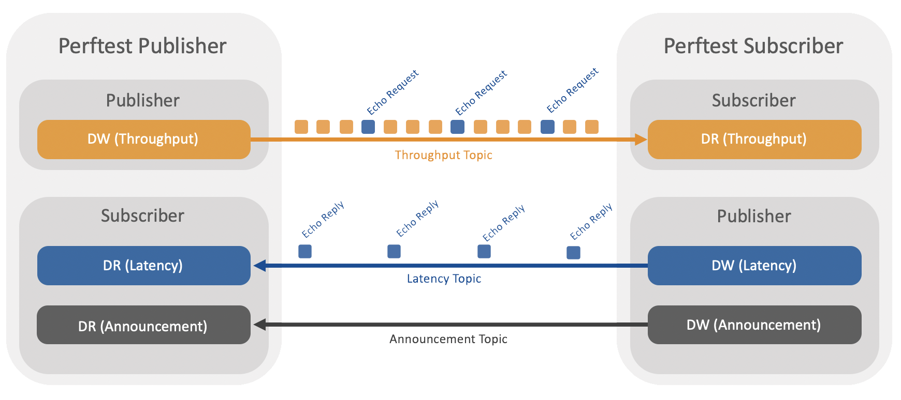

.. _section-introduction:

Introduction
============

Testing Performance
-------------------

This document describes how to run a combined latency and throughput
test application for *RTI Connext DDS*.

The test measures what is sometimes called loaded latency -- latency at
a given throughput level. It can help you answer questions such as:

-  For a given publishing configuration (e.g., queue size, batching
   settings), sample size, and subscribing configuration (e.g., queue
   size, Listener vs. WaitSet) what is the throughput of my network?

-  When my network is heavily loaded, what latency can I expect?

-  For a given configuration, what is the best-case latency with no
   other traffic on the network?

For examples of specific configurations, see See Example Command Lines
for Running the Performance Test.

This performance test is implemented in C++ (Traditional and Modern
APIs), C# and Java.

**Note:** All references in this document to “C++” refer to both the
Traditional and Modern C++ APIs unless otherwise noted.

Middleware
----------

*RTI Perftest* can be built against *RTI Connext DDS Pro* and *RTI Connext
DDS Micro* 3.0.0 (also 2.4.11 with some limitations).

*RTI Perftest* can also be used to test raw ``UDPv4`` or ``SHMEM`` performance.
In order to achieve this functionality, it uses the *RTI Connext DDS Pro* internal
transport layer to interact with sockets. In this mode *RTI Perftest* skips
the DDS protocol to directly send the data, which is serialized using the same
functions *RTI Connext DDS Pro* use.

Overview
--------

The publishing side of the test writes data as fast as it can. Every few
samples (configured through the command-line), it sends a special sample
requesting an echo from the subscribing side. It uses this
``request -> echo`` exchange to measure round-trip latency.

   PerfTest Overview Diagram

As you will see in Section 8, there are several command-line options,
including ones to designate whether the application will act as the
publisher or subscriber.

You will start multiple copies of the application (typically 1 publisher
and 1 or more subscribers):

-  The publishing application publishes throughput data; it also
   subscribes to the latency echoes.
-  The subscribing applications subscribe to the throughput data, in
   which the echo requests are embedded; they also publish the latency
   echoes.

The publisher prints the latency test results meanwhile the subscriber
prints the throughput results.

Latency Test vs Throughput Test
-------------------------------

*RTI Perftest* allows 2 operational modes: **Throghput Test** and **Latency Test**.

Throughput Test
~~~~~~~~~~~~~~~

This is the default mode when a *RTI Perftest* Publisher and a Subscriber
applications are started.

In this mode, The Publisher side will start sending samples as fast
as possible, and once every `latencyCount` samples (which for a Throughput
test is 10000 samples by default), it will mark the sample so it is answered
by the Subscriber side. The answer is the exact same sample, so, by getting the
time when it was sent and the time when the Publisher receives it back the
Round-Trip Time (RTT) can be calculated.

Doing a Throughput test will provide the maximum throughput (Mbps) at what
the Publisher will be able to send samples to a Subscriber. The latency obtained
in this test will be also displayed by the Publisher application, however,
that latency is impacted by the fact that the Publisher and the Subscriber will
be flooding the network and filling all their internal queues (sending and
receiver queues, as well as the Nic queues). Therefore, for measuring the pure
latency in the best case scenario, the **Latency Test** Mode should be used.

Latency Test
~~~~~~~~~~~~

In this mode the Publisher side changes its behavior: Every sample it sends
is marked as a latency sample (``LatencyCount`` is equal to 1 in this case).
It will also wait until the sample is sent back and received by the Publisher
prior to send the next sample (what it is called ``Stop-and-wait`` mode or
``ping-pong``mode).

By doing so, this mode is able to send samples ensuring all the *RTI Connext
DDS* queues will be empty.

The only requirement to change the operation mode to do a **Latency Test** is to
provide the ``-latencyTest`` command line parameter to the Publisher side. See
the **Command Line Parameters** section for more details.