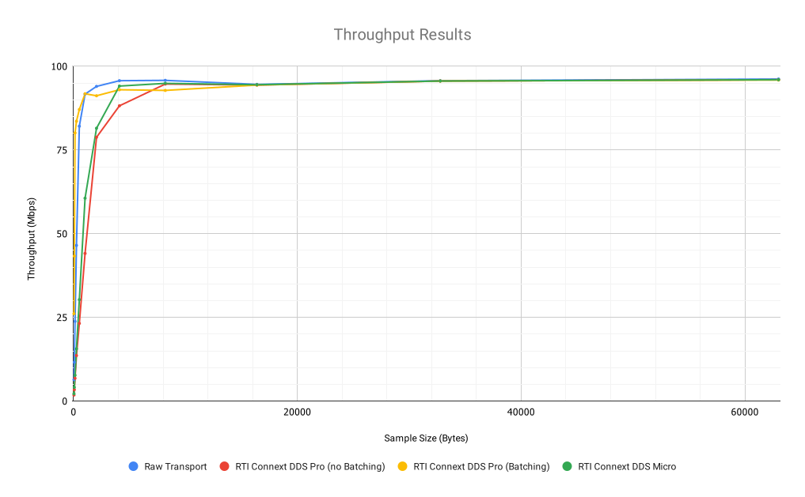
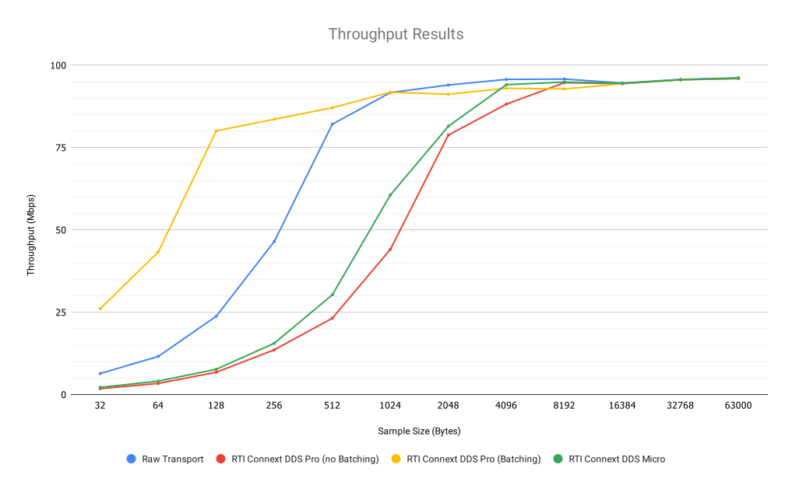
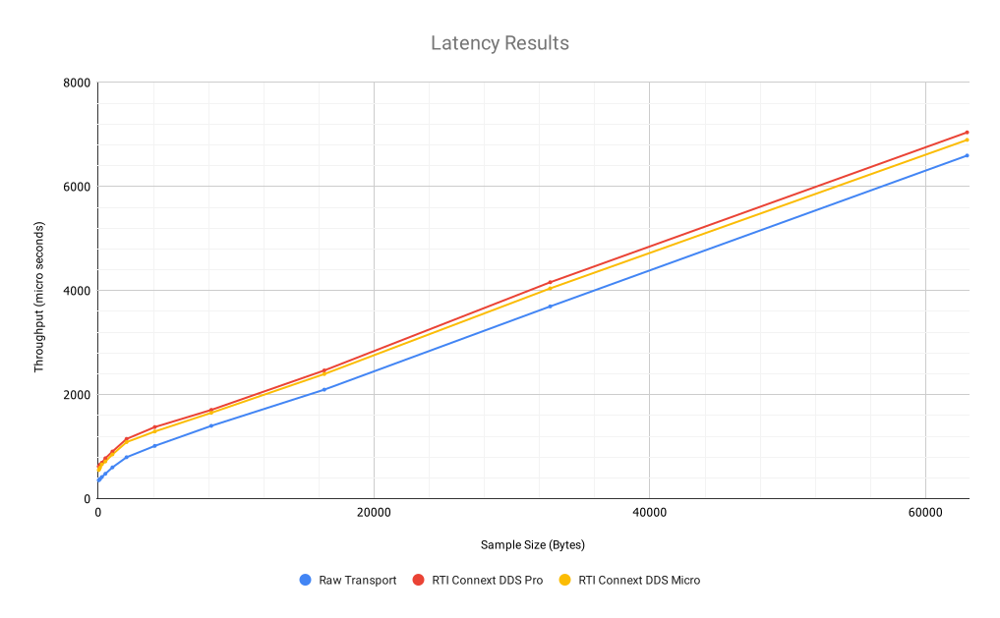
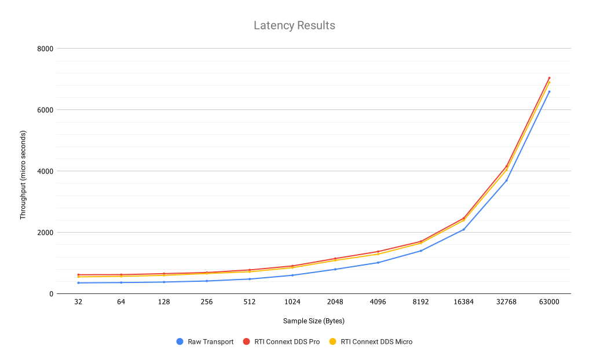

Characterize the performance of Connext DDS in a given environment using RTI Perftest
=====================================================================================

This tutorial is meant to be a quick guide about the initial steps we recommend to follow to profile and
characterize the performance between 2 machines in a given environment. This means understanding the maximum
throughput that **RTI Connext DDS** can maintain in a 1 to 1 communication, as well as the average latency we
can expect when sending samples.

For this guide we will use a couple Raspberry Pi boards, connected to a switch. See below the
information about the environment

   | Target machines: 2 x **Raspberry Pi 2 Model B**
   |                  OS: Raspbian GNU/Linux
   |                  CPU: ARMv7 Processor rev 5 (v7l)
   |                  NIC: 100Mbps - IP1: 10.45.3.119 / IP2: 10.45.3.120
   |                  Software: RTI Perftest 3.0, C++ Implementation.
   |                            RTI Connext DDS Professional 6.0.0
   |                            RTI Connext DDS Micro 3.0.0
   | Switch: 1Gbps switch

Prepare the tools
~~~~~~~~~~~~~~~~~

To run this test we will need **RTI Perftest 3.0** (Perftest). We will compile it against **RTI Connext DDS
Professional 6.0.0** and **RTI Connext DDS Micro 3.0.0**.

Get Perftest
^^^^^^^^^^^^

Getting the tool is fairly easy, in fact, you have 3 different ways in which you can access to it:

-  You can clone it from the official *Github* repository:

   Go to the `release page <https://github.com/rticommunity/rtiperftest/releases>`_ for **Perftest** and
   check what is the latest release, then clone that release using `git`. At this point the latest release is 3.0:

    .. code::

        git clone -b release/3.0 https://github.com/rticommunity/rtiperftest.git

   This command will download the *Github* repository in a folder named
   ``rtiperftest`` and move to the ``release/3.0`` branch.
   If you don't include the ``-b release/3.0``, you will clone the ``master`` branch
   of the product.

-  You can download a `zip` file containing the **Perftest** source files for the 3.0 release from
   the **Github** page:
   `github.com/rticommunity/rtiperftest <https://github.com/rticommunity/rtiperftest>`__.
   Once the zip file is downloaded you will need to extract its content,
   this will create a folder named ``rtiperftest``.

-  You can download a `zip/tar.gz` file containing the **Perftest** executable statically
   compiled for some of the most common platforms from the **Github** release page:
   `https://github.com/rticommunity/rtiperftest/releases <https://github.com/rticommunity/rtiperftest/releases>`__
   in the "Binaries" section. Once the zip file is downloaded you will need to extract its content, this will
   create a folder with the binaries for your architecture.

All this information is covered in the `download <https://github.com/rticommunity/rtiperftest/blob/3.0/srcDoc/download.rst>`__
section of the **Perftest** documentation.

Compile against RTI Connext DDS Professional 6.0.0
^^^^^^^^^^^^^^^^^^^^^^^^^^^^^^^^^^^^^^^^^^^^^^^^^^

If you already got the compiled binaries, you can skip this step. Else, you will need to compile the
binaries. This process is covered in the `compilation <https://github.com/rticommunity/rtiperftest/blob/3.0/srcDoc/compilation.rst>`__
section of the **Perftest** documentation, so we will just summarize.

We want to build **Perftest** for the *Raspberry Pi* target libraries, this architecture is `armv6vfphLinux3.xgcc4.7.2`, even
though you should be able to compile everything in a raspberry pi, we are going to cross-compile this architecture.
This process should be really simple with *Perftest*, since we will just need
to have in the `$PATH` environment variable the path to the compiler and linker for the given architecture.

Therefore the command we will need to execute should look like this:

    .. code::

        export PATH=<Path to the compiler and linker for armv6vfphLinux3.xgcc4.7.2>:$PATH
        ./build.sh --platform armv6vfphLinux3.xgcc4.7.2 --nddshome <Path to your nddshome> --cpp-build

Alternatively, you can just point to the compiler and linker using the ``--compiler`` and ``--linker``
command line options. As you can see we also specified the ``--cpp-build`` option,
this is because we are going to use only the C++ executable to test with.

After executing this, you should have a statically linked binary in `./bin/armv6vfphLinux3.xgcc4.7.2/release`,
this is all you should need for your testing.

Compile against RTI Connext DDS Micro 3.0.0
^^^^^^^^^^^^^^^^^^^^^^^^^^^^^^^^^^^^^^^^^^^

This process should be equivalent to the one described in the previous step, and it is also covered
in the `compilation <https://github.com/rticommunity/rtiperftest/blob/3.0/srcDoc/compilation.rst>`__
section of the **Perftest** documentation.

**Note:** Although you will need to call the build script two times for compiling for **RTI Connext DDS Proffesional**
and **Micro**, you don't need to use two different directories, since the executables will be stored
with different names. It is also worth mentioning that cross-testing (Using a **Perftest** Publisher from **Professional**
and a Subscriber from **Micro** or viceversa) is supported.

Therefore the command we will need to execute should look like this:

    .. code::

        export PATH=<Path to the compiler and linker for armv6vfphLinux3.xgcc4.7.2>:$PATH
        ./build.sh --micro --platform armv6vfphLinux3.xgcc4.7.2 --rtimehome <Path to your rtimehome>

After executing this, you should have a statically linked binary in ``./bin/armv6vfphLinux3.xgcc4.7.2/release``,
this is all you should need for your testing.

Tests
~~~~~

Our goal is to characterize how *Connext DDS* behaves in the communication between 2 *Raspberry Pi* nodes connected
to one switch and compare it with the performance of sending samples with UDPv4 sockets.
The first thing we will need to know is what is the *minimum latency* and *maximum throughput*
achievable in that environment with UDPv4 sockets. Luckily this is something that we can get with **Perftest**:
By using the ``-rawTransport`` option, we skip the use of *RTPS** and **DDS** and we just send using UDPv4 sockets.

We will be doing a *Latency Test* and a *Throughput Test* (See
`this <https://github.com/rticommunity/rtiperftest/blob/3.0/srcDoc/introduction.rst#latency-test-vs-throughput-test>`__ section to understand the
differences).

Once that is done, we will have a baseline which is going to tell us the minimum latency we can expect
and the maximum throughput achievable in the system when not using *RTPS* and *DDS*. The next step
is then to execute **Perftest** using *DDS* with **Professional** and **Micro** and see the equivalents results.

UDPv4 Communication (Raw Transport)
^^^^^^^^^^^^^^^^^^^^^^^^^^^^^^^^^^^

Throughput Test
---------------

The maximum throughput of this scenario will be limited by several factors: If the size of the samples we
are sending is small, the CPU consumption will be high, since it will need to iterate through the process
of sending the samples to the NIC quite often. If the size of the sample is big enough, then the problem
is the physical limitations of the network itself, how fast the nics and the switch are.

In our specific case, the switch is a 1Gbps switch which should not be the cap, since the *Raspberry Pi* nics
we are using have 100Mbps NICs. Then, 100Mbps is our maximum theoretical throughput.

Given all this information, the right way to perform the test is by iterating through different data sizes. We
will use the following commands:

* **Publisher side**

    .. code::

        for DATALEN in 32 64 128 256 512 1024 2048 4096 8192 16384 32768 63000; do
            bin/armv6vfphLinux3.xgcc4.7.2/release/perftest_cpp -pub -peer 10.45.3.119 -nic eth0 -raw -noPrint -exec 20 -datalen $DATALEN -batchSize 0;
        done

* **Subscriber side**

    .. code::

        for DATALEN in 32 64 128 256 512 1024 2048 4096 8192 16384 32768 63000; do
            bin/armv6vfphLinux3.xgcc4.7.2/release/perftest_cpp -sub -peer 10.45.3.120 -nic eth0 -raw -noPrint -datalen $DATALEN;
        done

Some comments about the parameters we used:

* In `Raw Transport Mode` the `-scan` option is not available, that is why we need to iterate through
  the different data sizes using a for loop (in `bash`).

* In `Raw Transport Mode` we do not have a discovery mechanism, as we do have when
  Using **RTI Connext DDS**, therefore, it is required to use the `-peer` parameter.

* In throughput mode, by default, **Perftest** uses "batching", as this feature is not
  native to sending using sockets, we have implemented it at the application level
  in the **Perftest** application. Therefore, in order to compare the raw transport behavior,
  we want to disable it for this test, that can be done simply by using `-batchSize 0`.

See below the output results of executing this test. The information displayed here is
only what the subscriber side showed, since all the information displayed in the publisher
side is related to latency, not throughput.

Throughput Results-- RAW Transport (UDPv4)
::::::::::::::::::::::::::::::::::::::::::

    .. csv-table::
        :align: center
        :header-rows: 1

        "Size", "Packets", "Packets/s (ave)", "Mbps (ave)", "Lost", "Lost (%)"
        32, 503906, 25193, 6.4, 975, 0.19
        64,454201,22697,11.6,1608,0.35
        128,465202,23259,23.8,1170,0.25
        256,454120,22706,46.5,12466,2.67
        512,400530,20043,82.1,7027,1.72
        1024,223798,11191,91.7,4718,2.06
        2048,114800,5737,94.0,119,0.10
        4096,58412,2919,95.7,1,0.00
        8192,29247,1461,95.8,4,0.01
        16384,14446,722,94.6,0,0.00
        32768,7307,365,95.7,3,0.04
        63000,3819,190,96.2,0,0.00

Latency Test
------------

Now we want to measure the minimum latency we can expect in the system when the network
is not saturated, this can be done again with **Perftest**, doing a "Latency Test". In order
to do that, you only need to add `-latencyTest` to the previous command line parameters of the
publisher side.

* **Publisher side**

    .. code::

        for DATALEN in 32 64 128 256 512 1024 2048 4096 8192 16384 32768 63000; do
            bin/armv6vfphLinux3.xgcc4.7.2/release/perftest_cpp -pub -peer 10.45.3.119 -nic eth0 -raw -noPrint -exec 20 -datalen $DATALEN -latencyTest;
        done

* **Subscriber side**

    .. code::

        for DATALEN in 32 64 128 256 512 1024 2048 4096 8192 16384 32768 63000; do
            bin/armv6vfphLinux3.xgcc4.7.2/release/perftest_cpp -sub -peer 10.45.3.120 -nic eth0 -raw -noPrint -datalen $DATALEN;
        done

Remember that in this case we are interested in the latency results, not in the
throughput results (we are doing a ping-pong test, so we cannot expect high throguhput),
therefore we need to look to the results displayed in the publisher side.

Latency Results -- RAW Transport (UDPv4)
::::::::::::::::::::::::::::::::::::::::

    .. csv-table::
        :align: center
        :header-rows: 1

        "Size", "Ave (us)", "Std (us)", "Min (us)", "Max (us)", "50% (us)", "90% (us)", "99% (us)", "99.99% (us)", "99.9999% (us)"
        32,357,77.7,310,6094,355,371,470,5436,6094
        64,370,76.5,305,3935,365,387,491,3693,3935
        128,386,88.3,318,6573,381,403,512,5549,6573
        256,419,82.0,360,6451,416,438,546,4810,6451
        512,485,72.5,435,5913,479,503,610,4571,5913
        1024,608,96.5,545,6507,602,633,757,6435,6507
        2048,809,102.2,736,5605,797,845,994,5318,5605
        4096,1027,120.2,952,8083,1015,1058,1196,8083,8083
        8192,1412,106.1,1325,5969,1400,1456,1608,5969,5969
        16384,2107,222.5,1931,9573,2096,2153,2338,9573,9573
        32768,3693,223.2,3477,8656,3696,3768,4046,8656,8656
        63000,6601,212.9,6424,10706,6595,6752,7002,10706,10706

RTI Connext DDS Professional (UDPv4)
^^^^^^^^^^^^^^^^^^^^^^^^^^^^^^^^^^^^

Throughput Test
---------------

The idea is the same as we did in the previous test, get the maximum throughput we can
achieve, but this time we will use our middleware to test with (**RTI Connext DDS Professional 6.0.0**)

Then, the command line parameters are going to be quite similar:

* **Publisher side**

    .. code::

        bin/armv6vfphLinux3.xgcc4.7.2/release/perftest_cpp -pub -nic eth0 -noPrint -exec 20 -scan -batchSize 0

* **Subscriber side**

    .. code::

        bin/armv6vfphLinux3.xgcc4.7.2/release/perftest_cpp -sub -nic eth0 -noPrint;

Notice that now we removed the `-raw` parameter, and that we do not need the *for loop* anymore, since
**Perftest** for **Connext DDS** support the use of the `-scan` parameter. Also notice that we are using
`-batchSize 0`. We will also test later using batching. Lastly, we also removed the `-peer` parameter, the reason
being that **Connext DDS** uses by default multicast for the discovery phase, so there is no need to specify
where the counterpart application is.

Since we are using **RTI Connext DDS**, **Perftest** will be choose some *QoS* settings. The best way
to understand what is being used, is by looking at the initial summary **Perftest** shows:

    .. code::

        RTI Perftest 3.0.0 06ff338 (RTI Connext DDS 6.0.0)

        Mode: THROUGHPUT TEST
            (Use "-latencyTest" for Latency Mode)

        Perftest Configuration:
            Reliability: Reliable
            Keyed: No
            Publisher ID: 0
            Latency count: 1 latency sample every 10000 samples
            Data Size: 32, 64, 128, 256, 512, 1024, 2048, 4096, 8192, 16384, 32768, 63000
            (Set the data size on the subscriber to the maximum data size to achieve best performance)
            Batching: No (Use "-batchSize" to setup batching)
            Publication Rate: Unlimited (Not set)
            Execution time: 20 seconds
            Receive using: Listeners
            Domain: 1
            Dynamic Data: No
            FlatData: No
            Zero Copy: No
            Asynchronous Publishing: No
            XML File: perftest_qos_profiles.xml

        Transport Configuration:
            Kind: UDPv4
            Nic: eth0
            Use Multicast: False

See below the output results of executing this test. Again, the information displayed here is
only what the subscriber side showed.

Throughput Results -- RTI Connext DDS Professional (UDPv4) -- No batching
:::::::::::::::::::::::::::::::::::::::::::::::::::::::::::::::::::::::::

    .. csv-table::
        :align: center
        :header-rows: 1

        "Size", "Packets", "Packets/s (ave)", "Mbps (ave)", "Lost", "Lost (%)"
        32,140000,7100,1.8,0,0.00
        64,140000,6719,3.4,0,0.00
        128,140000,6680,6.8,0,0.00
        256,140000,6632,13.6,0,0.00
        512,110000,5663,23.2,0,0.00
        1024,110000,5383,44.1,0,0.00
        2048,100000,4810,78.8,0,0.00
        4096,60000,2690,88.2,0,0.00
        8192,30000,1445,94.7,0,0.00
        16384,20000,720,94.4,0,0.00
        32768,10000,364,95.6,0,0.00
        63000,10000,190,96.0,0,0.00

We will discuss the results later, but in **RTI Connext DDS Professional** we have a very
interesting feature worth mentioning:
`batching <https://community.rti.com/static/documentation/connext-dds/6.0.0/doc/manuals/connext_dds/html_files/RTI_ConnextDDS_CoreLibraries_UsersManual/index.htm#UsersManual/BATCH_Qos.htm#sending_2410472787_2558262>`__.
By using this feature we will be able to send more efficiently by sending several
data samples as part of the same packet therefore improving our
maximum throughput. The cost however will be the latency of the packets.

The following results were taken by using **Perftest**'s default batching size: `8192` bytes:

Throughput Results -- RTI Connext DDS Professional (UDPv4) -- Batching (8192 Bytes)
:::::::::::::::::::::::::::::::::::::::::::::::::::::::::::::::::::::::::::::::::::

    .. csv-table::
        :align: center
        :header-rows: 1

        "Size", "Packets", "Packets/s (ave)", "Mbps (ave)", "Lost", "Lost (%)"
        32,1990000,102062,26.1,0,0.00
        64,1660000,84590,43.3,0,0.00
        128,1540000,78193,80.1,0,0.00
        256,810000,40818,83.6,0,0.00
        512,430000,21257,87.1,0,0.00
        1024,220000,11200,91.8,0,0.00
        2048,110000,5568,91.2,0,0.00
        4096,60000,2837,93.0,0,0.00
        8192,30000,1416,92.8,0,0.00
        16384,20000,719,94.4,0,0.00
        32768,10000,364,95.6,0,0.00
        63000,10000,190,95.9,0,0.00

You might see already how by using this feature, we can highly improve the thoughput
achieved for small data samples. See the *Results* section for a deeper analysis.

Latency Test
------------

We continue doing a latency test, under the same precepts we followed when testing with
the `-rawTransport` option:

* **Publisher side**

    .. code::

        bin/armv6vfphLinux3.xgcc4.7.2/release/perftest_cpp -pub -nic eth0 -noPrint -exec 20 -scan -latencyTest

* **Subscriber side**

    .. code::

        bin/armv6vfphLinux3.xgcc4.7.2/release/perftest_cpp -sub -nic eth0 -noPrint;

The *QoS* picked by **Perftest** are the following ones:

    .. code::

        RTI Perftest 3.0.0 06ff338 (RTI Connext DDS 6.0.0)

        Mode: LATENCY TEST (Ping-Pong test)

        Perftest Configuration:
            Reliability: Reliable
            Keyed: No
            Publisher ID: 0
            Latency count: 1 latency sample every 1 samples
            Data Size: 32, 64, 128, 256, 512, 1024, 2048, 4096, 8192, 16384, 32768, 63000
            (Set the data size on the subscriber to the maximum data size to achieve best performance)
            Batching: No (Use "-batchSize" to setup batching)
            Publication Rate: Unlimited (Not set)
            Execution time: 20 seconds
            Receive using: Listeners
            Domain: 1
            Dynamic Data: No
            FlatData: No
            Zero Copy: No
            Asynchronous Publishing: No
            XML File: perftest_qos_profiles.xml

        Transport Configuration:
            Kind: UDPv4
            Nic: eth0
            Use Multicast: False

And these are the results (taken from the publisher side):

Latency Results -- RTI Connext DDS Professional (UDPv4)
:::::::::::::::::::::::::::::::::::::::::::::::::::::::

    .. csv-table::
        :align: center
        :header-rows: 1

        "Size", "Ave (us)", "Std (us)", "Min (us)", "Max (us)", "50% (us)", "90% (us)", "99% (us)", "99.99% (us)", "99.9999% (us)"
        32,632,140.2,480,6999,620,726,939,6985,6999
        64,633,131.7,480,7571,623,739,952,4615,7571
        128,670,128.5,497,6541,656,753,961,5355,6541
        256,709,139.0,542,6941,692,803,1037,5863,6941
        512,796,172.9,604,7244,777,884,1148,6338,7244
        1024,926,109.0,784,4626,907,1001,1214,3993,4626
        2048,1172,184.3,1013,8003,1149,1258,1529,8003,8003
        4096,1395,145.4,1172,6768,1377,1480,1736,6768,6768
        8192,1736,198.8,1497,8689,1707,1863,2141,8689,8689
        16384,2500,212.8,2279,8992,2465,2615,2940,8992,8992
        32768,4172,214.6,3877,10726,4160,4315,4577,10726,10726
        63000,7073,214.1,6772,9722,7041,7260,7694,9722,9722

RTI Connext DDS Micro 3.0.0 (UDPv4)
^^^^^^^^^^^^^^^^^^^^^^^^^^^^^^^^^^^

We will now repeat the same tests we did for **RTI Connext DDS Professional** but for
**Micro**.

Throughput Test
---------------

* **Publisher side**

    .. code::

        bin/armv6vfphLinux3.xgcc4.7.2/release/perftest_cpp_micro -pub -nic eth0 -noPrint -exec 20 -scan

* **Subscriber side**

    .. code::

        bin/armv6vfphLinux3.xgcc4.7.2/release/perftest_cpp_micro -sub -nic eth0 -noPrint;

Note that we don't use the `-batchSize` option, this is because this option is not yet available
in **RTI Connext DDS Micro 3.0.0**.

The initial summary **Perftest** shows is the following:

    .. code::

        RTI Perftest 3.0.0 (RTI Connext DDS Micro 3.0.0)

        Mode: THROUGHPUT TEST
            (Use "-latencyTest" for Latency Mode)

        Perftest Configuration:
            Reliability: Reliable
            Keyed: No
            Publisher ID: 0
            Latency count: 1 latency sample every 10000 samples
            Data Size: 32, 64, 128, 256, 512, 1024, 2048, 4096, 8192, 16384, 32768, 63000
            (Set the data size on the subscriber to the maximum data size to achieve best performance)
            Publication Rate: Unlimited (Not set)
            Execution time: 20 seconds
            Receive using: Listeners
            Domain: 1

        Transport Configuration:
            Kind: UDPv4
            Nic: eth0
            Use Multicast: False

See below the output results of executing this test. Again, the information displayed here is
only what the subscriber side showed.

Throughput Results -- RTI Connext DDS Micro (UDPv4)
:::::::::::::::::::::::::::::::::::::::::::::::::::

    .. csv-table::
        :align: center
        :header-rows: 1

        "Size", "Packets", "Packets/s (ave)", "Mbps (ave)", "Lost", "Lost (%)"
        32,174555,8725,2.2,0,0.00
        64,161835,8091,4.1,0,0.00
        128,151267,7561,7.7,0,0.00
        256,152305,7615,15.6,0,0.00
        512,147956,7397,30.3,0,0.00
        1024,147902,7393,60.6,0,0.00
        2048,99530,4975,81.5,0,0.00
        4096,57451,2870,94.1,0,0.00
        8196,28964,1447,94.9,0,0.00
        16384,14435,721,94.5,0,0.00
        32768,7295,364,95.6,0,0.00
        63000,3812,190,96.0,0,0.00

Latency Test
------------

* **Publisher side**

    .. code::

        bin/armv6vfphLinux3.xgcc4.7.2/release/perftest_cpp_micro -pub -nic eth0 -noPrint -exec 20 -scan -latencyTest

* **Subscriber side**

    .. code::

        bin/armv6vfphLinux3.xgcc4.7.2/release/perftest_cpp_micro -sub -nic eth0 -noPrint;

The initial summary **Perftest** shows is the following:

    .. code::

        RTI Perftest 3.0.0 (RTI Connext DDS Micro 3.0.0)

        Mode: LATENCY TEST (Ping-Pong test)

        Perftest Configuration:
            Reliability: Reliable
            Keyed: No
            Publisher ID: 0
            Latency count: 1 latency sample every 1 samples
            Data Size: 32, 64, 128, 256, 512, 1024, 2048, 4096, 8192, 16384, 32768, 63000
            (Set the data size on the subscriber to the maximum data size to achieve best performance)
            Publication Rate: Unlimited (Not set)
            Execution time: 20 seconds
            Receive using: Listeners
            Domain: 1

        Transport Configuration:
            Kind: UDPv4
            Nic: eth0
            Use Multicast: False

And these are the results (taken from the publisher side):

Latency Results -- RTI Connext DDS Micro (UDPv4)
::::::::::::::::::::::::::::::::::::::::::::::::

    .. csv-table::
        :align: center
        :header-rows: 1

        "Size", "Ave (us)", "Std (us)", "Min (us)", "Max (us)", "50% (us)", "90% (us)", "99% (us)", "99.99% (us)", "99.9999% (us)"
        32,560,158.9,361,6121,551,652,838,6070,6121
        64,572,139.4,382,7642,567,665,861,5958,7642
        128,609,135.6,431,5897,600,687,869,5716,5897
        256,670,115.0,489,5394,660,749,936,5224,5394
        512,725,130.1,551,6414,716,799,1002,5175,6414
        1024,868,366.8,676,36814,851,938,1133,6913,36814
        2048,1095,162.8,879,6341,1088,1177,1433,6341,6341
        4096,1309,453.6,1083,38591,1292,1379,1643,38591,38591
        8192,1666,167.7,1349,6790,1651,1769,2032,6790,6790
        16384,2416,628.4,2146,39850,2396,2516,2844,39850,39850
        32768,4046,246.8,3732,8894,4042,4161,4594,8894,8894
        63000,6909,176.8,6564,9529,6896,7102,7368,9529,9529

Understanding the Results
^^^^^^^^^^^^^^^^^^^^^^^^^

Lets go first with the throughput results and plot all the different tests together:

The first thing we see is that at 5KB we are already close to saturate the
network in all cases, which is something really good to see, but lets focus
in the behavior for smaller samples. Lets plot the same results with a
logarithmic scale:

Now we can extract more information about the graphs:

1. If we take out the test where we make use of *batching* we can see that using
   Raw Transport (plain sockets) gives us the best performance.

2. **Connext DDS Pro** and **Connext DDS Micro** behave in a really similar way,
   being the latter slighly better.

3. The use of *batching* really makes a difference for small samples sizes.

4. After 5kB we can consider that all the tests are able to reach more than a 95%
   of the network utilization, which is the maximum bandwidth supported by the NICs.

By what we state in 1, one might wonder why not using plain sockets for our communications,
why having use a middleware for this. However, at this point is when we have to remember
that when testing with *Plain Sockets*, we had nothing: We didn't have a discovery
mechanism (we had to specify the peers by hand), we didn't have any reliability and samples
would not get repaired when lost. In fact we didn't have any *QoS* setting at all.

by using **RTI Connext DDS** you are adding a discovery mechanism, a reliability mechanism,
the option of tuning the *QoS* of the system, etc. Lastly, you have to remember what we
stated in 4 and 3: The advantage of *Plain Sockets* is only noticeable when the data length
is quite small, and even in those cases, by using certain features, **RTI Connext DDS** can
keep up, or even improve the performance provided by *Raw Sockets*.

Another important topic is if we should choose **RTI Connext DDS Micro** instead of
**Professional** based on the performance you want to achieve. Although it is correct that
the former will achieve better performance for simple scenarios like this
one, **Professional** offers more features than **Micro** (like *batching* or
*Content-Filtered Topics*). On the other side, Micro is ideal to run in resource
constrained devices where **Professional** may not fit.

Let's continue now by plotting the latency results (we will plot the lineal and logarithmic
scale graphs):

As we saw with the throughput test, **RTI Connext DDS Professional** and **Micro**
have pretty similar performance results, being the latter slightly better (mainly
because the code complexity is smaller).

It is also interesting to notice that the difference in terms of microseconds
between *Raw Sockets* and **RTI Connext DDS Professional** and **Micro** remains
constant across the different data sizes. The reason behind that is that the
difference in time is due to the extra logic we use to send and receive (send and
receive queues, etc), however, that extra logic is independent on the data size.

Based on these test we learned useful information about the use of **RTI Connext DDS**
in this environment: We know now the maximum throughput that the system can accept,
so we can design our system to never cross that line. We also got the minimum latency
we can expect to have, which is going to help us determine if the system will be able
to meet the deadlines of the different data-flows.
